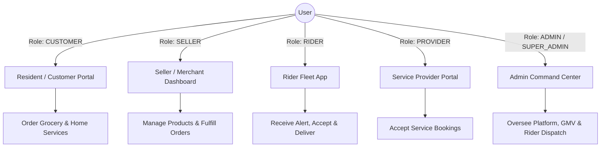
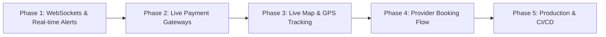

# 📌 dohsSheba Project Overview & Roadmap

> **Hyperlocal E-Commerce & Home Services Platform for DOHS Communities**  
> *Connecting Residents, Merchants, Service Providers, Riders, and Admins in a unified digital ecosystem.*

---

## 🗺️ 1. Project Mission & Concept

**dohsSheba** is a full-stack, role-based hyperlocal marketplace tailored for residential Defense Officers Housing Society (DOHS) areas in Dhaka (*Mohakhali, Baridhara, Mirpur, Banani*). 

The platform bridges:
1. **Grocery & Daily Essentials Delivery** (From local merchant stores to resident doorsteps).
2. **Home Services & Repairs** (Electricians, plumbers, cleaning, appliance repair).
3. **Dedicated Fleet Dispatch** (On-duty riders delivering groceries and handling local logistics).

---

## 🏗️ 2. Technology Stack & Architecture

```
dohsSheba/
├── backend/          # Node.js + Express + TypeScript + Prisma ORM + PostgreSQL
├── frontend/         # Next.js (App Router) + React + TypeScript + Tailwind CSS
└── docs/             # Technical specifications & dynamic feature implementation plans
```

### **Tech Stack Breakdown**

| Layer | Technologies |
| :--- | :--- |
| **Frontend Framework** | [Next.js](file:///d:/dohsSheba/frontend) (App Router, React 18/19, TypeScript) |
| **Styling & UI** | Tailwind CSS, Lucide React Icons, Framer Motion animations |
| **State Management** | Zustand (Global Cart, Auth state, Modal triggers) |
| **Backend API** | [Node.js / Express](file:///d:/dohsSheba/backend/src/app.ts) with TypeScript modular controller/service design |
| **Database & ORM** | PostgreSQL database with [Prisma ORM](file:///d:/dohsSheba/backend/prisma/schema.prisma) |
| **Authentication** | JWT (JSON Web Tokens) with role-based guard middlewares |

---

## 👥 3. Multi-Role Portals & Capabilities



### 1. 🛒 Resident / Customer Portal (`/dashboard`)
* Browse produce, groceries, and local home services.
* Address management (*Mohakhali DOHS, Baridhara DOHS, etc.*).
* Persistent shopping cart, coupon checkout, and wallet payment methods.
* Real-time order tracking timeline.

### 2. 🏪 Seller / Merchant Dashboard (`/seller/dashboard`)
* Store inventory management (add/edit products, stock status, categories).
* Order fulfillment hub (manage order statuses: `PROCESSING`, `SHIPPED`).
* Store analytics (Revenue trends, total orders, top-selling items).
* Store settings, customer review management, and payouts.

### 3. 🛵 Rider Fleet App (`/rider/dashboard`)
* **Foodpanda-Style Dispatch Alert:** Real-time modal with 30-second countdown audio/timer to accept/decline orders.
* **Duty Toggle:** Instant switch between `ON_DUTY` and `OFF_DUTY`.
* **Active Delivery Stepper:** Live progress (`Store Pickup` ➔ `On the Way` ➔ `Doorstep Delivery`).
* Earnings history, trip statistics, and completion rate.

### 4. 🔧 Service Provider Portal (`/provider/dashboard`)
* Manage offered service listings, pricing per hour/job.
* Incoming booking schedule and customer location details.

### 5. 🛡️ Admin & Super Admin Command Center (`/admin/dashboard/ecommerce`)
* Platform analytics (GMV, total orders, rider performance, store registrations).
* **Rider Dispatch System:** View online/busy riders and manually/automatically assign riders to pending orders.
* User role management, store verification, and platform configuration.

---

## 🗄️ 4. Data Model Summary (Prisma Schema)

* **Users & Profiles:** `User`, `Role` (`GUEST`, `CUSTOMER`, `PROVIDER`, `SELLER`, `RIDER`, `ADMIN`, `SUPER_ADMIN`), `Address`, `SellerProfile`, `ProviderProfile`, `RiderProfile`.
* **E-Commerce:** `Product`, `ProductCategory`, `Cart`, `CartItem`, `Order`, `OrderItem`, `Coupon`, `Review`.
* **Services:** `Service`, `ServiceCategory`, `Booking`.
* **Finance & Alerts:** `Wallet`, `WalletTransaction`, `Notification`.

### Order Lifecycle Flow
$$\text{PENDING} \xrightarrow{\text{Rider Assigned}} \text{RIDER\_ASSIGNED} \xrightarrow{\text{Seller Prepares}} \text{PROCESSING} \xrightarrow{\text{Rider Picked Up}} \text{SHIPPED} \xrightarrow{\text{Delivered}} \text{DELIVERED}$$

---

## 🔑 5. Seeded Demo Accounts & Credentials

The backend seed script ([`prisma/seed.ts`](file:///d:/dohsSheba/backend/prisma/seed.ts)) provides pre-populated test accounts:

| Role | Email | Password | Purpose |
| :--- | :--- | :--- | :--- |
| **Super Admin** | `superadmin@example.com` | `SuperAdmin@123` | Platform oversight & configuration |
| **Admin** | `admin@example.com` | `Admin@123` | Order dispatch & marketplace management |
| **Seller** | `seller@example.com` | `Seller@123` | Fresh Bazaar store owner dashboard |
| **Rider 1** | `rider@example.com` | `Rider@123` | Rider Akash (Fleet #04) |
| **Rider 2** | `rider2@example.com` | `Rider@123` | Rider Tanvir (Fleet #08) |
| **Customer** | `customer@example.com` | `Customer@123` | Resident Sharmin Sultana |
| **Customer 2** | `customer2@example.com` | `Customer@123` | Resident Engr. Tanvir Islam |

---

## ✅ 6. Current Implementation Status

- [x] **Backend API Architecture:** Express controllers, services, routes, Prisma ORM database models & seeders.
- [x] **Seller Dashboard:** Full dynamic UI for products, orders, sales analytics, review management.
- [x] **Admin Dashboard:** Rider dispatch system, GMV overview, ecommerce statistics.
- [x] **Rider App:** Foodpanda-style dispatch alert overlay, duty toggle, trip stepper.
- [x] **Customer Dashboard:** Responsive UI for shopping, order history, addresses, profile.

---

## 🚀 7. Recommended Next Steps & Action Plan



### 🔴 Phase 1: Real-Time Communication (WebSockets / Socket.io)
- [ ] Connect Socket.io between Backend, Admin, Seller, and Rider apps.
- [ ] Push instant order popups to online riders as soon as Admin assigns or Customer orders.
- [ ] Send live order status updates to Resident UI without page refresh.

### 🟡 Phase 2: Payment Gateway Integration
- [ ] Integrate local payment gateways (**bKash**, **Nagad**, **SSLCommerz**) alongside **Stripe** and **Cash on Delivery**.
- [ ] Complete auto-deduction/top-up for resident Wallet balance.

### 🟢 Phase 3: Live GPS & Map Route Tracking
- [ ] Integrate Leaflet / Mapbox / Google Maps API in Rider App and Customer Order Tracking screen.
- [ ] Show live rider route from merchant store to resident building.

### 🔵 Phase 4: Service Provider Workflow Polish
- [ ] Build out service provider booking acceptance and scheduling UI.
- [ ] Add service job completion certificate & customer payment release workflow.

### 🟣 Phase 5: Testing, Hardening & Deployment
- [ ] Write integration test cases for order fulfillment and dispatch logic.
- [ ] Set up Docker containers for frontend, backend, and PostgreSQL.
- [ ] Deploy to production hosting (*Vercel for Frontend, Render/Railway/DigitalOcean for Backend & DB*).

---
*Generated for **dohsSheba** repository.*
