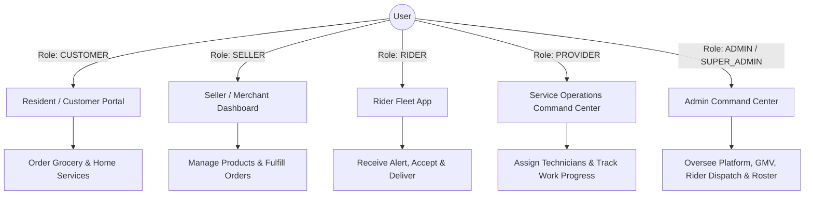

# 📌 dohsSheba Project Overview & Roadmap

> **Hyperlocal E-Commerce & Home Services Platform for DOHS Communities**  
> *Connecting Residents, Merchants, Service Providers, Riders, and Admins in a unified digital ecosystem.*

---

## 🗺️ 1. Project Mission & Concept

**dohsSheba** is a full-stack, role-based hyperlocal marketplace tailored for residential Defense Officers Housing Society (DOHS) areas in Dhaka (*Mohakhali, Baridhara, Mirpur, Banani*). 

The platform bridges:
1. **Grocery & Daily Essentials Delivery** (From local merchant stores to resident doorsteps).
2. **Company-Managed Home Services & Repairs** (DOHS Sheba Service Team: Electricians, plumbers, cleaning, AC maintenance, appliance repair).
3. **Dedicated Fleet Dispatch** (On-duty riders delivering groceries and handling local logistics).

---

## 🏗️ 2. Technology Stack & Architecture

```
dohsSheba/
├── backend/          # Node.js + Express + TypeScript + Prisma ORM + PostgreSQL
├── frontend/         # Next.js (App Router) + React + TypeScript + Tailwind CSS
└── docs/             # Technical specifications & dynamic feature implementation plans
```

### **Tech Stack Breakdown**

| Layer | Technologies |
| :--- | :--- |
| **Frontend Framework** | [Next.js](file:///d:/dohsSheba/frontend) (App Router, React 18/19, TypeScript) |
| **Styling & UI** | Tailwind CSS, Lucide React Icons |
| **State Management** | Zustand (Global Cart, Auth state, Modal triggers) |
| **Backend API** | [Node.js / Express](file:///d:/dohsSheba/backend/src/app.ts) with TypeScript modular controller/service design |
| **Database & ORM** | PostgreSQL database with [Prisma ORM](file:///d:/dohsSheba/backend/prisma/schema.prisma) |
| **Authentication** | JWT (JSON Web Tokens) with role-based guard middlewares |

---

## 👥 3. Multi-Role Portals & Capabilities



### 1. 🛒 Resident / Customer Portal (`/dashboard`)
* Browse produce, groceries, and DOHS Sheba managed home services.
* Address management (*Mohakhali DOHS, Baridhara DOHS, etc.*).
* Persistent shopping cart, coupon checkout, and wallet payment methods.
* Real-time order tracking timeline & **Service Status Stepper** (`PENDING` ➔ `CONFIRMED` ➔ `TECHNICIAN_ASSIGNED` ➔ `TECHNICIAN_ON_THE_WAY` ➔ `IN_PROGRESS` ➔ `WORK_COMPLETED` ➔ `CUSTOMER_CONFIRMED`).

### 2. 🏪 Seller / Merchant Dashboard (`/seller/dashboard`)
* Store inventory management (add/edit products, stock status, categories).
* Order fulfillment hub (manage order statuses: `PROCESSING`, `SHIPPED`).
* Store analytics (Revenue trends, total orders, top-selling items).
* Store settings, customer review management, and payouts.

### 3. 🛵 Rider Fleet App (`/rider/dashboard`)
* **Foodpanda-Style Dispatch Alert:** Real-time modal with 30-second countdown audio/timer to accept/decline orders.
* **Duty Toggle:** Instant switch between `ON_DUTY` and `OFF_DUTY`.
* **Active Delivery Stepper:** Live progress (`Store Pickup` ➔ `On the Way` ➔ `Doorstep Delivery`).
* Earnings history, trip statistics, and completion rate.

### 4. 🛡️ Service Operations Command Center (`/provider/dashboard`)
* Centralized dispatch center for `DOHS Sheba Service Team`.
* Incoming booking queue and technician assignment modal (assign internal technicians Rakib, Hasan, Mahmud, Sabbir).
* Work progress updates (`PENDING` ➔ `CONFIRMED` ➔ `ASSIGNED` ➔ `IN_PROGRESS` ➔ `COMPLETED`).

### 5. 👑 Admin & Super Admin Command Center (`/admin/dashboard/services`)
* Platform analytics (GMV, total orders, rider performance, store registrations).
* **Technician Roster Management:** Add, update, and manage internal company service technicians.
* User role management, store verification, and platform configuration.

---

## 🔑 4. Seeded Demo Accounts & Credentials

The backend seed script ([`prisma/seed.ts`](file:///d:/dohsSheba/backend/prisma/seed.ts)) provides pre-populated test accounts:

| Role | Email | Password | Purpose |
| :--- | :--- | :--- | :--- |
| **Super Admin** | `superadmin@dohssheba.com` | `password123` | Platform oversight & configuration |
| **Admin** | `admin@dohssheba.com` | `password123` | Order dispatch & marketplace management |
| **Seller** | `seller@dohssheba.com` | `password123` | Fresh Bazaar store owner dashboard |
| **Rider 1** | `rider@dohssheba.com` | `password123` | Rider Akash (Fleet #04) |
| **Customer** | `customer@dohssheba.com` | `password123` | Resident Sharmin Sultana |

---

## ✅ 5. Final Implementation Status

- [x] **Backend API Architecture:** Express controllers, services, routes, Prisma ORM database models & seeders.
- [x] **Service Module Transformation:** Converted from provider marketplace to **Company-Managed Service Operations Model** (`DOHS Sheba Service Team`).
- [x] **Internal Technician Roster:** Integrated technician assignment workflow and admin roster management (`/api/v1/technicians`).
- [x] **Seller Dashboard:** Full dynamic UI for products, orders, sales analytics, review management.
- [x] **Admin Dashboard:** Rider dispatch system, GMV overview, ecommerce statistics, technician roster management.
- [x] **Rider App:** Foodpanda-style dispatch alert overlay, duty toggle, trip stepper.
- [x] **Customer Dashboard:** Responsive UI for shopping, order history, live service booking status stepper, addresses, profile.
- [x] **UI/UX Loading States:** Dynamic `ProductGridSkeleton` loaders for category & subcategory browsing pages.
- [x] **Production Infrastructure & SSL:** Deployed on VPS running Ubuntu 24.04, Nginx Reverse Proxy with Let's Encrypt SSL/HTTPS (`https://shop.dohsedu.com`).
